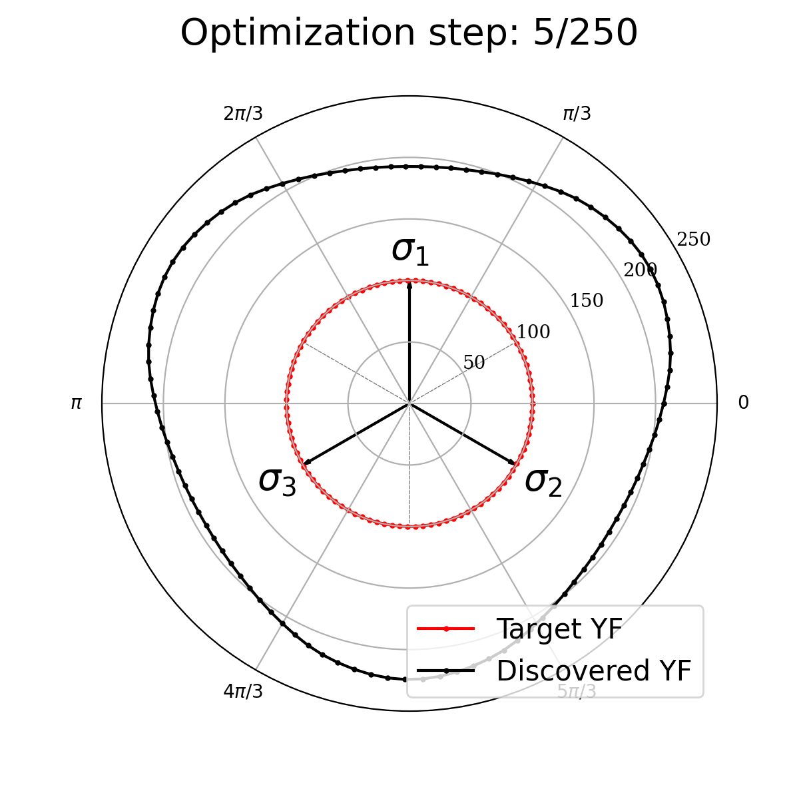

# Discovering neural elastoplasticity from kinematic observations (PNAS 2025)

We introduce a learning algorithm to discover neural network parameterized yield functions and hardening rules using displacement fields. 


## Setup & Examples 

Modify the input file `input.yaml` to change the analysis settings and the material type. 
To run examples with **perfect plasticity**, set in `input.yaml`:

```yaml
Hardening: False
```

In `MPM_inverse.py`, the constant `DIM_IN` defines the number of inputs to the neural network:

- **Perfect plasticity**
```python
DIM_IN = wp.constant(2)
```

- **Plasticity with hardening**
```python
DIM_IN = wp.constant(3)
```

The neural network parameters and the displacement data are loaded from the **`Input`** directory.

To run the examples excecute `main.py`.



## Dependencies

The following libraries are required: 

| Package               | Version (>=) |
|-----------------------|--------------|
| numpy                 | 1.25.2       |
| torch                 | 2.0.1        |
| nvidia-warp           | 1.11.0       |

## Citation

```bibtex
@article{barkoulis2025neuralelastoplasticity,
doi = {10.1073/pnas.2508732122},
author = {Georgios Barkoulis Gavris and WaiChing Sun},
title = {Discovering neural elastoplasticity from kinematic observations},
journal = {Proceedings of the National Academy of Sciences},
volume = {122},
number = {38},
pages = {e2508732122},
year = {2025},
url = {https://www.pnas.org/doi/abs/10.1073/pnas.2508732122}}

