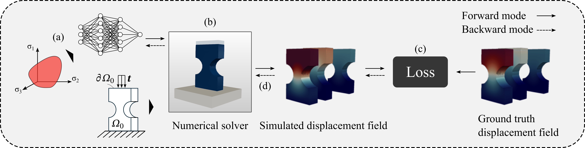

# Discovering neural elastoplasticity from kinematic observations (PNAS 2025)

We introduce a learning algorithm to discover neural network parameterized yield functions and hardening rules using displacement fields. 




## Setup & Examples 

Modify the input file `input.yaml` to change the analysis settings and the material type. To run examples with perfect plasticity, set:

```yaml
Hardening: False
```

The NNs parameters and the displacement data are loaded from the **Input** folder. 

To run the examples excecute `main.py`.

## Dependencies

The following libraries are required: 

| Package               | Version (>=) |
|-----------------------|--------------|
| numpy                 | 1.25.2       |
| torch                 | 2.0.1        |
| nvidia-warp           | 1.6.0        |

## Citation

```bibtex
@article{barkoulis2025neuralelastoplasticity,
doi = {10.1073/pnas.2508732122},
author = {Georgios Barkoulis Gavris and WaiChing Sun},
title = {Discovering neural elastoplasticity from kinematic observations},
journal = {Proceedings of the National Academy of Sciences},
volume = {122},
number = {38},
pages = {e2508732122},
year = {2025},
url = {https://www.pnas.org/doi/abs/10.1073/pnas.2508732122}}

